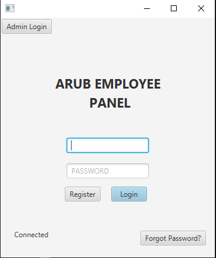

Hello,

What is it about?

My name is Mevlut Saluk, s3717696. A student of Further Programming. This project was coded as a Hotdesk for the employees of 
Arub(company). This project allows an employee of the company to book a seat for a day that will
not be reassigned to them the next day. The employees will have the ability to register 
themselves to the system, reset password, book and edit their details. Another panel apart from
the employees panel is the Admin panel where it is for the admins to login to. Admins have
the ability to control the bookings and employee details. They can generate reports, accept or reject
the booking of an employee, whitelist and delete an employee record. In overall, the program is of a very friendly nature and is easy to understand and control.

What steps need to be taken?

The program runs from the Main class and requires a user to login or register in order
to use additional features.

Execution examples:

GREETING PANEL:

STAFF PANEL AFTER LOGIN:

ADMIN PANEL AFTER LOGIN:
    

ADMIN MANAGEMENT CONTROLS:

EMPLOYEE BOOKING:

Bugs & Problems:

- When locking down a seat, the first seat that gets locked down
functions correctly and becomes locked however when entering a new
  seat to lock on the same scene, it adds the first seats boolean from
  1 -> 2.
- Couldn't implement the visual booking method.
- Tableview was not used.
- Booking does not automatically cancel after certain time.